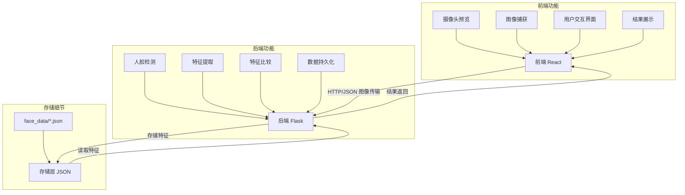

# 人脸识别系统项目报告

## 1️⃣ 问题定义（Problem Definition）

本项目旨在构建一个基于浏览器的人脸识别系统，用于解决身份验证和人员识别的实际需求。在现代社会，自动化身份验证变得越来越重要，尤其在需要快速、无接触式验证的场景下。

**实际应用场景：**
- **安全门禁系统**：替代传统的钥匙或卡片进入方式，通过人脸识别提供更便捷的入口控制。
- **考勤管理**：学校或公司可以使用此系统自动记录学生或员工的出勤情况，无需手动签到。
- **个性化服务**：商业场所可以通过识别回头客提供个性化的服务和推荐。
- **医疗身份确认**：在医院环境中，确保对正确的病人实施正确的医疗程序。

用户使用本系统只需通过浏览器访问，无需安装额外软件，大大降低了使用门槛，同时系统的本地部署特性保障了数据隐私和安全性。

## 2️⃣ 技术栈分析（Technology Stack）

本项目使用了以下技术栈，每个技术的选择都有其特定的考量：

1. **前端技术：**
   - **React**：用于构建用户界面的JavaScript库，提供组件化开发和高效的DOM更新机制。选择React是因为其单向数据流模式简化了状态管理，同时具有强大的社区支持。
   - **原生JavaScript**：通过Babel进行转译，实现浏览器兼容性。选择使用原生JS而非框架如Vue或Angular，是为了减少依赖，保持项目轻量级。

2. **后端技术：**
   - **Flask**：Python的微型Web框架，用于构建后端API服务。选择Flask是因为其轻量级、灵活性和上手简单的特点，非常适合构建原型和中小型应用。
   - **Flask-CORS**：处理跨域资源共享问题，使前后端能够安全地通信。

3. **计算机视觉技术：**
   - **MediaPipe**：Google开发的机器学习解决方案，用于人脸检测和特征提取。选择MediaPipe而非dlib，主要考虑到：
     1. 安装便捷性，无需复杂的编译过程
     2. 跨平台兼容性高
     3. CPU/GPU自动优化，不需手动切换
   - **OpenCV**：强大的计算机视觉库，用于图像处理。本项目中用于读取、转换和处理图像数据。

4. **数据处理技术：**
   - **NumPy**：高效的数值计算库，用于处理数组和向量计算，特别是在计算欧氏距离和相似度上发挥作用。
   - **JSON**：用于数据持久化存储和前后端数据交换。选择JSON格式是因为其轻量级、可读性强且与JavaScript原生兼容。

5. **部署方案：**
   - **本地服务器**：项目设计为在本地计算机上运行，避免了云服务成本，同时保障数据隐私。
   - **IPv4和端口映射**：允许在同一局域网内的设备（如手机）访问服务。

这些技术的组合考虑了开发效率、性能表现、跨平台兼容性以及学习曲线等因素，使项目既能实现需求功能，又保持了代码的可维护性和系统的稳定性。

## 3️⃣ 处理机制（Processing Mechanism）

本系统的数据处理流程如下：

1. **人脸注册流程：**
   - 用户在前端输入姓名并点击"注册人脸"按钮
   - 前端将当前摄像头画面转换为Base64编码的图像数据
   - 通过API将图像数据和姓名发送到后端
   - 后端解码图像数据为OpenCV格式
   - 使用MediaPipe进行人脸检测
   - 提取人脸关键点作为特征向量
   - 将特征向量与姓名关联并存储到系统内存和JSON文件中
   - 返回注册结果到前端

2. **人脸识别流程：**
   - 用户点击"识别人脸"按钮
   - 前端将当前摄像头画面转换为Base64编码的图像数据
   - 通过API将图像数据发送到后端
   - 后端解码图像数据为OpenCV格式
   - 使用MediaPipe进行人脸检测
   - 提取人脸关键点作为特征向量
   - 将提取的特征向量与数据库中所有已注册特征向量进行相似度比较
   - 找出相似度最高且超过阈值(70%)的匹配项
   - 返回识别结果（包含边界框、姓名和置信度）到前端
   - 前端显示识别结果，并在图像上绘制边界框和姓名标签

3. **数据持久化机制：**
   - 系统启动时，从face_data目录加载已注册的人脸特征数据
   - 新注册的人脸特征立即保存为JSON文件，确保系统重启后数据不丢失

**系统架构图：**

## 4️⃣ 算法说明（Algorithm Description）

本系统的核心算法主要集中在人脸检测、特征提取和相似度比较三个方面：

1. **人脸检测算法：**
   - **输入**：RGB格式图像数据
   - **处理**：使用MediaPipe的Face Detection模型进行人脸区域检测
   - **输出**：包含人脸边界框坐标(x, y, width, height)的数据结构
   - **工作原理**：MediaPipe采用基于机器学习的BlazeFace检测器，该检测器是为移动设备优化的轻量级CNN模型，具有高效率和较高准确性

2. **特征提取算法：**
   - **输入**：裁剪后的人脸图像
   - **处理**：使用MediaPipe的Face Mesh模型提取面部关键点
   - **输出**：包含面部关键点3D坐标(x, y, z)的特征向量
   - **工作原理**：Face Mesh模型可以识别和定位面部的468个关键点，每个点包含x、y、z三维坐标信息，形成高精度的人脸特征表示

3. **相似度计算算法：**
   - **输入**：两个人脸特征向量
   - **处理**：计算欧氏距离并转换为相似度分数
   - **输出**：0到1之间的相似度值（1表示完全相同）
   - **核心公式**：
     - 欧氏距离计算: Distance = √(∑(x₁ᵢ - x₂ᵢ)²)
     - 相似度转换: Similarity = max(0, 1 - Distance/10)
     - 其中10是经验常数，用于将距离标准化到合理的相似度范围

4. **决策阈值机制：**
   - 注册检查：如果相似度 > 95%，则认为是重复注册
   - 识别决策：如果相似度 > 70%，则接受为有效匹配

这些算法的组合构成了系统的核心识别机制。特别值得注意的是，相比于深度学习生成的嵌入向量，本系统基于几何关键点的特征表示更为直观，在计算资源有限的情况下仍能提供不错的识别效果。

## 5️⃣ 开发过程（Development Process）

开发过程可分为以下几个阶段：

1. **需求分析阶段**：
   - 明确系统核心功能：人脸注册和识别
   - 确定用户界面需求：摄像头预览、切换功能、结果显示等
   - 确定系统限制：本地部署、无需特殊硬件

2. **技术选型阶段**：
   - 面临的挑战：多平台兼容性问题，特别是在不同操作系统上CUDA配置复杂
   - 解决方案：选择MediaPipe替代dlib，避免因CUDA配置引起的问题
   - 决定使用Flask作为后端框架，React作为前端技术，提供良好的开发效率和用户体验

3. **编码实现阶段**：
   - 开发后端API：实现/register和/recognize两个主要端点
   - 实现前端界面：构建响应式UI组件，实现摄像头访问和图像处理
   - 数据持久化：设计基于JSON文件的简单存储机制

4. **测试和优化阶段**：
   - 遇到问题：NumPy数组在布尔上下文中使用导致错误
   - 解决方法：修改条件判断语句，使用`is None`代替`not image`
   - 遇到问题：静态类型检查器报告MediaPipe模块路径错误
   - 解决方法：添加适当的类型注释和忽略指令
   - 性能优化：调整相似度阈值，平衡误识率和漏识率

5. **部署配置阶段**：
   - 配置本地服务器允许通过IP访问
   - 设置调试模式方便开发排错
   - 创建虚拟环境确保依赖隔离

开发过程中最具挑战性的部分是解决跨平台兼容性问题和处理图像数据流。使用MediaPipe代替传统的dlib是一个关键决策，大大简化了部署流程并提高了系统稳定性。

## 6️⃣ 学到的技术（Learned Skills）

通过本项目的开发，获得了以下技术和知识的提升：

1. **Web技术**：
   - 掌握使用Flask构建RESTful API
   - 理解前后端分离架构和CORS处理
   - 学习Base64图像编码和HTTP请求处理

2. **计算机视觉技术**：
   - 掌握MediaPipe库的使用方法，特别是人脸检测和网格提取功能
   - 理解OpenCV与前端Canvas的结合使用方式
   - 学习人脸特征提取和比对算法原理

3. **前端开发技能**：
   - 学习React的状态管理和组件生命周期
   - 掌握浏览器媒体API的使用，包括摄像头访问和视频流处理
   - 理解Canvas绘图API用于标注识别结果

4. **数据处理技能**：
   - 掌握NumPy进行高效的向量计算，特别是欧氏距离计算
   - 学习JSON格式数据的序列化和持久化存储

5. **系统集成技能**：
   - 理解Python虚拟环境的配置和依赖管理
   - 掌握Web应用的调试和错误处理技术
   - 学习不同编程语言和框架之间的数据交换方式

6. **开发工具使用**：
   - 熟悉VS Code的开发环境配置
   - 掌握使用Pylance等静态类型检查工具提高代码质量
   - 学习解决类型检查与动态导入库之间的兼容性问题

这些技能不仅对本项目有价值，也为未来的软件开发工作奠定了基础，特别是在AI与Web技术结合的应用领域。

## 7️⃣ 结论与改进建议（Conclusion & Improvements）

### 结论

本项目成功实现了一个基于Web的人脸识别系统，具有以下优点：
1. 跨平台兼容性良好，可在各种操作系统上稳定运行
2. 安装部署简便，依赖少，配置要求低
3. 提供了简洁明了的用户界面，操作直观
4. 实现了基本的人脸注册和识别功能，在简单应用场景下表现良好
5. 采用本地部署方式，保护用户隐私和数据安全

系统展示了如何将现代Web技术与计算机视觉算法有效结合，为身份验证领域提供了一种轻量级解决方案。

### 改进建议

尽管本系统已经实现了基本功能，但仍有多个方面可以进一步优化和扩展：

1. **算法改进**：
   - 集成深度学习的人脸嵌入向量模型（如FaceNet），提高识别准确性
   - 添加活体检测功能，防止照片欺骗
   - 实现多人脸同时识别和追踪功能

2. **功能扩展**：
   - 增加批量注册功能，支持从已有照片库导入人脸
   - 添加人脸分类和分组功能，方便管理大量用户
   - 实现历史记录和访问日志，记录识别历史

3. **用户界面优化**：
   - 添加多语言支持，提高国际化水平
   - 优化移动端适配，提升在各种设备上的用户体验
   - 设计暗黑模式和更多个性化设置

4. **系统架构提升**：
   - 使用数据库（如SQLite、PostgreSQL）替代JSON文件存储，提高数据处理能力
   - 添加用户认证和权限管理，增强系统安全性
   - 实现websocket通信，支持实时通知和多客户端同步

5. **部署方案扩展**：
   - 提供Docker容器化部署选项，简化环境配置
   - 设计云服务部署方案，支持远程访问和多设备协作
   - 优化资源使用，降低系统负载，提高并发处理能力

通过以上改进，该系统可以从原型演示发展为具有实用价值的完整产品，适用于更广泛的应用场景和更复杂的使用需求。
